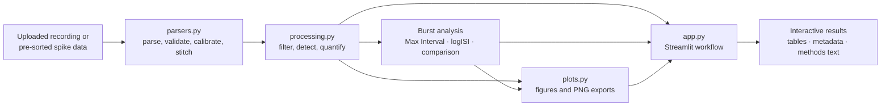

# SpikeLab

### Offline, single-channel MEA spike and burst analysis

[](docs/VALIDATION.md)
[](environment.yml)
[](https://streamlit.io/)
[](LICENSE)

SpikeLab (distributed as **MEA Spike Analyser**) is a local Streamlit application for analysing
offline Multi-Electrode Array recordings one electrode at a time. It brings spike detection, burst
analysis, waveform quantification, publication-oriented figures, data exports, and draft methods
text into a single interactive workflow.

The application runs locally and does not require a database, cloud service, or account.

## Highlights

- Analyse continuous recordings or pre-sorted NeuroExplorer spike data.
- Detect spikes from filtered voltage traces or use curated spike timestamps.
- Run Max Interval, adaptive logISI, or a direct comparison of both burst methods.
- Explore signal, waveform, amplitude, ISI, burst, and correlation views.
- Export figures, spike- and burst-level tables, and analysis metadata.
- Generate a draft methods paragraph from the active analysis settings.
- Keep recordings on the local machine throughout analysis.

For input contracts, algorithms, formulas, parameters, exports, scientific references, and
interpretation guidance, see the [complete documentation](docs/DOCUMENTATION.md).

## Architecture

The application is intentionally compact. Streamlit orchestration lives in `app.py`, while parsing,
numerical processing, and plotting remain in focused modules.



## Analysis workspaces

SpikeLab groups related results into five top-level workspaces. Views appear only when the selected
input provides the required signal or waveform data.

| Workspace | Purpose |
| --- | --- |
| **Overview** | Inspect spike activity and firing rate across the recording |
| **Signal** | Review continuous voltage traces and available spike waveforms |
| **Spike analysis** | Explore amplitude, waveform, and inter-spike interval measurements |
| **Burst analysis** | Inspect burst summaries, dynamics, correlations, and method comparison |
| **Data & export** | Review result tables and download analysis artifacts |

## Installation

Python 3.9 or newer is required. Python 3.11 is used in continuous integration.

### Conda (recommended)

```bash
git clone https://github.com/lakshayxi/spikelab.git
cd spikelab
conda env create -f environment.yml
conda activate mea_tool
streamlit run app.py
```

### pip

```bash
git clone https://github.com/lakshayxi/spikelab.git
cd spikelab
python -m venv .venv
source .venv/bin/activate
pip install -r requirements.txt
streamlit run app.py
```

On Windows, activate the virtual environment with:

```bat
.venv\Scripts\activate
```

The app opens at [http://localhost:8501](http://localhost:8501).

### Lab launchers

After installing Conda, macOS users can run `Start_MEA_Analyser.command` and Windows users can run
`Start_MEA_Analyser.bat`. The launchers create the `mea_tool` environment when needed, activate it,
and start Streamlit.

## Quick start

1. Start SpikeLab and upload a supported recording or NeuroExplorer export.
2. Select the signal or electrode when the source contains multiple channels.
3. Adjust spike, burst, and waveform settings in the sidebar.
4. Review the overview before inspecting detailed signal, spike, and burst results.
5. Open **Data & export** to download the required tables, metadata, and methods text.

The [user manual](docs/DOCUMENTATION.md) covers each supported input and control in detail.

## Documentation

- [`docs/DOCUMENTATION.md`](docs/DOCUMENTATION.md) — complete user manual, data formats, analysis pipeline,
  methods, metrics, workspace reference, exports, limitations, glossary, and references.
- [`docs/PLOTS_GUIDE.md`](docs/PLOTS_GUIDE.md) — interpretation guide for figures and derived metrics.
- [`docs/VALIDATION.md`](docs/VALIDATION.md) — deterministic scientific regression fixtures,
  expected results, validation commands, and the boundary between regression and biological
  validation.

## Project structure

```text
.
├── app.py                         # Streamlit UI, orchestration, caching, and exports
├── parsers.py                     # TXT/CSV, EDF, NeuroExplorer, and stitching logic
├── processing.py                  # Filtering, detection, burst algorithms, and metrics
├── plots.py                       # Matplotlib figures and PNG export helpers
├── docs/
│   ├── DOCUMENTATION.md           # Complete user and method reference
│   ├── PLOTS_GUIDE.md             # Plot interpretation guide
│   └── VALIDATION.md              # Scientific regression-validation record
├── environment.yml                # Conda runtime environment
├── requirements.txt               # pip runtime dependencies
├── Start_MEA_Analyser.command     # macOS launcher
└── Start_MEA_Analyser.bat         # Windows launcher
```

This is the layout of the distributed package (`MEA_Spike_Analyser.zip` / this repository). The
full development source — tests, lint config, and the release build script — lives in the private
`spikelab-dev` repository.

## Limitations

- Analysis is limited to one selected signal or electrode per run.
- Continuous-trace spike detection is negative-going only.
- Text/CSV traces require regular, strictly increasing timestamps.
- EDF processing is in memory and limited to continuous recordings up to 512 MiB.
- Some waveform metrics depend on source-specific timing or user-declared amplitude units.
- Parameter choice remains preparation dependent.
- Regression tests do not establish biological or clinical validity.

See [Known Limitations](docs/DOCUMENTATION.md#12-known-limitations) for the complete scientific and
technical boundary.

## Contributing

Issues and focused pull requests are welcome.

1. Fork the repository and create a branch from `main`.
2. Install runtime dependencies: `pip install -r requirements.txt`.
3. Describe the behaviour change clearly, including how you verified it — the automated test suite
   (pytest, Ruff) runs against the full development source in the private `spikelab-dev` repository.
4. Keep UI text, generated methods text, and detailed documentation synchronized with scientific or
   user-facing changes.
5. Sanity-check the app starts cleanly:

```bash
python -m compileall .
streamlit run app.py
```

When changing runtime dependencies, keep `environment.yml` and `requirements.txt` synchronized.

## License

SpikeLab is available under the [MIT License](LICENSE). Copyright © 2026 Lakshay Saini.
